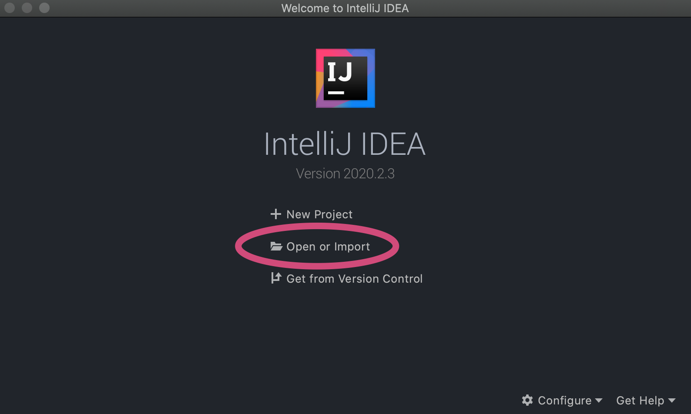
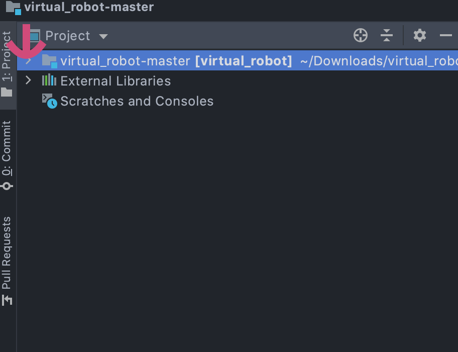
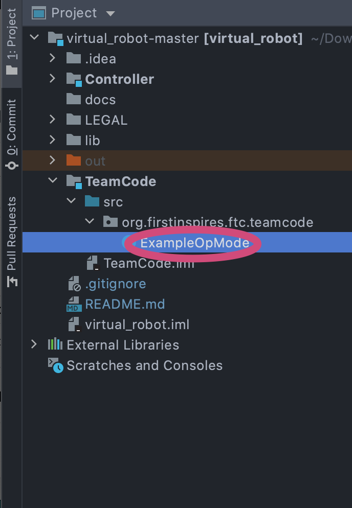

# FTC Robot Simulator
*This project is forked from [8397's Virtual Robot](https://github.com/Beta8397/virtual_robot).*

I set this up for you guys so you can play with a robot without a robot, in a realistic-ish FTC environment.

## Running the Project
First of all if you don't have IntelliJ, [download IntelliJ here](https://www.jetbrains.com/idea/download).
It's the IDE (Integrated Development Environment-- aka, a fancy text editor) we will use for this project.

1. Download ZIP for this project (the green Code button above)
2. Unzip the file (something like virtual_robot-master.zip)
3. Open IntelliJ
4. Open > virtual_robot-master (the folder)

5. On the left side of the window that appears, you will see the folders

6. Look inside `TeamCode` > `src` > `org.firstinspires.ftc.teamcode` > `ExampleOpMode`. Open up that Example.

7. Stare at the code and comments
8. Run the program. Click the green little play button on the top bar of your screen.

9. Does it run? Yay! If not, message me with your problems.

> So... what exactly should I do with this now?

Play around! Try to make the robot move straight, left, right, etc.
My goal is for you to be more comfortable with the flow of FTC and
understand the core of FTC programming.